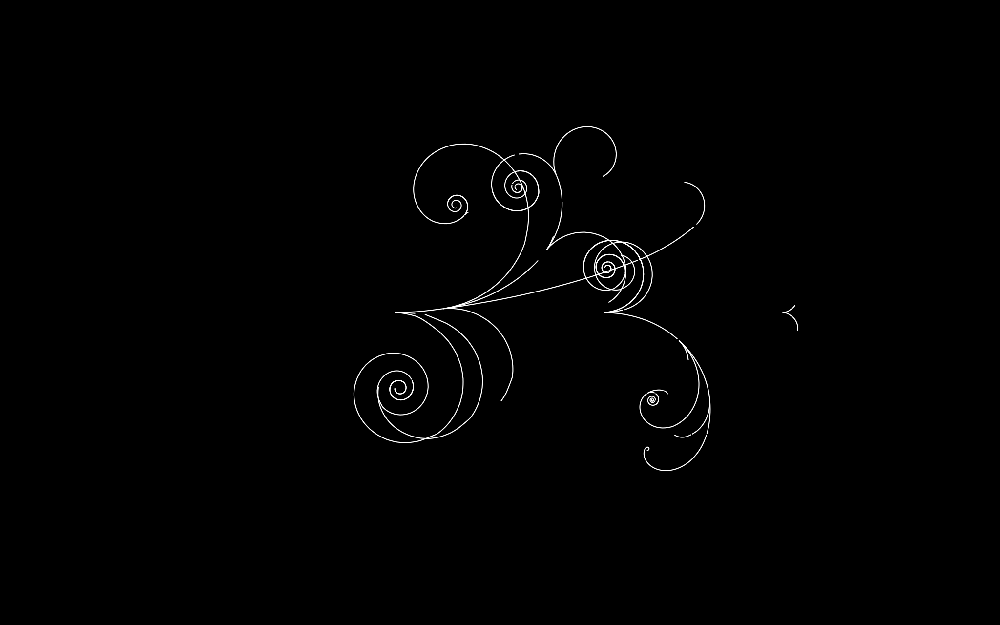

# Bubble Chamber

Bubble Chamber is a generative art project that tries to mimic phenomena seen in
[cloud chambers](https://en.wikipedia.org/wiki/Cloud_chamber) and
[bubble chambers](https://en.wikipedia.org/wiki/Bubble_chamber).
It's written in Rust on the [Amethyst engine](https://amethyst.rs/).

It simulates decaying, charged particles moving through a magnetic field, and renders
the trajectories to the screen and an SVG file.
I strive to make every part of the
simulation configurable in [sim_config.ron](resources/sim_config.ron), so it's easy to
run many different simulations without having to recompile the program.
